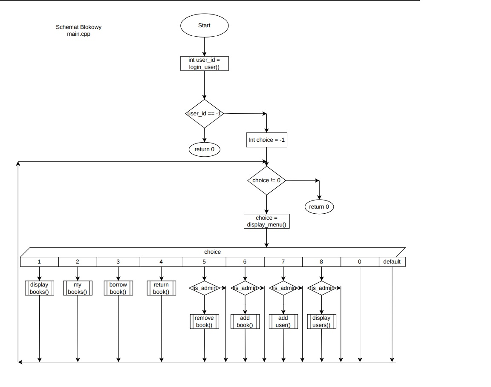
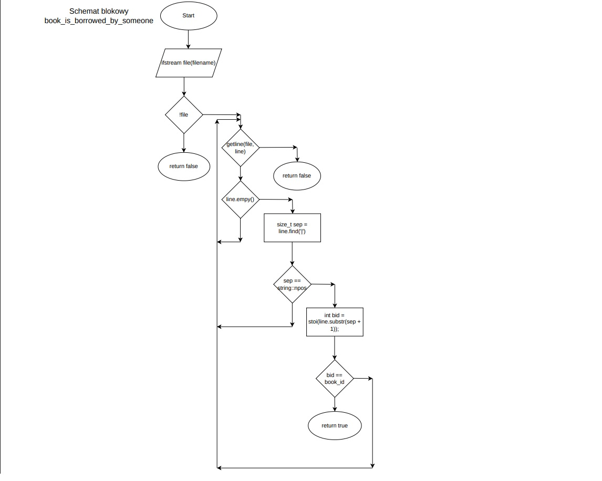

# 📚 Library Service  
**File-Based Library Management System (C++)**

---

# 📑 Table of Contents

## 🇬🇧 English Version
1. Introduction
2. System Architecture
3. Data Model
4. Data Storage Design
5. Functional Description
6. Core Algorithms
7. Block Diagrams
8. Computational Complexity
9. Limitations
10. Possible Improvements

# 🇬🇧 English Version

## 1. Introduction

Library Service is a console-based application written in C++ that simulates a basic library management system.  
The system does not use a database engine. Instead, it relies on structured text files to provide persistent storage.

The purpose of this project is to demonstrate:

- File handling in C++
- Modular software architecture
- Role-based access control
- Data parsing and validation
- Algorithmic design using file rewriting techniques

The system differentiates between regular users and administrators and enforces access control accordingly.

---

## 2. System Architecture

The application follows a modular design.  
Each logical component is separated into individual source and header files.

### Project Structure

```
main.cpp      – program entry point and control flow
books.cpp     – book management operations
users.cpp     – user management operations
loans.cpp     – loan management operations
models.h      – data structure definitions
config.h      – file configuration constants
```

This architecture improves readability, maintainability, and scalability.

---

## 3. Data Model

### Book Structure

```cpp
struct Book {
    int id;
    std::string title;
    std::string author;
    int year;
    bool available;
};
```

### User Structure

```cpp
struct User {
    int id;
    std::string login;
    bool is_admin;
};
```

The system processes data directly from files instead of storing full datasets permanently in memory.

---

## 4. Data Storage Design

The system uses three text files for persistent storage.

### books.txt

Format:

```
id|title|author|year|available
```

Example:

```
1|Pan Tadeusz|Adam Mickiewicz|1834|1
```

Where:
- `1` = available
- `0` = borrowed

---

### users.txt

Format:

```
id|login|is_admin
```

Example:

```
1|admin|1
2|user|0
```

---

### loans.txt

Format:

```
user_id|book_id
```

Example:

```
2|5
```

Each record is stored as a single line and parsed using the `|` delimiter.

---

## 5. Functional Description

### Regular User Capabilities

- Display all books
- Borrow a book
- Return a book
- Display personal borrowed books

### Administrator Capabilities

- Add a new book
- Remove a book
- Add a new user
- Display all users

Administrative permissions are validated using role verification logic.

---

## 6. Core Algorithms

Since text files do not allow direct record modification, the application uses a temporary file rewriting mechanism.

### File Modification Process

1. Open original file.
2. Create temporary file.
3. Copy all records except the modified one.
4. Close both files.
5. Replace original file with temporary file.

This guarantees data consistency.

---

### Borrow Book Algorithm

1. Validate book existence.
2. Check if the book is already borrowed.
3. Update book availability in `books.txt`.
4. Add loan record to `loans.txt`.
5. Confirm operation.

---

### Return Book Algorithm

1. Verify loan existence.
2. Update book availability.
3. Remove loan record.
4. Confirm operation.

---

## 7. Computational Complexity

All search operations operate in linear time complexity:

```
O(n)
```

Where `n` is the number of records in a given file.

---

## 8. Limitations

- No password authentication
- Linear search performance
- No concurrency control
- No database constraints

---

## 9. Block Diagrams

- main.cpp



- book_is_borrowed_by_someone



## 9. Possible Improvements

- Replace text files with a relational database
- Implement password-based authentication
- Add indexing for faster searches
- Introduce graphical user interface
- Implement transaction safety

---

---

# 📑Spis Treści

# 🇵🇱 Wersja Polska
1. Wprowadzenie
2. Architektura Systemu
3. Model Danych
4. Projekt Przechowywania Danych
5. Opis Funkcjonalny
6. Algorytmy Kluczowe
7. Schematy Blokowe
8. Złożoność Obliczeniowa
9. Ograniczenia
10. Możliwe Rozszerzenia

## 1. Wprowadzenie

Library Service to aplikacja konsolowa napisana w języku C++, która symuluje podstawowy system zarządzania biblioteką.  
System nie wykorzystuje bazy danych. Zamiast tego opiera się na ustrukturyzowanych plikach tekstowych jako trwałym mechanizmie przechowywania danych.

Celem projektu jest demonstracja:

- Obsługi plików w C++
- Modularnej architektury oprogramowania
- Kontroli dostępu opartej na rolach
- Parsowania i walidacji danych
- Projektowania algorytmów z użyciem techniki przepisywania plików

System rozróżnia użytkowników zwykłych i administratorów oraz egzekwuje odpowiednie uprawnienia.

---

## 2. Architektura Systemu

Aplikacja posiada budowę modularną.  
Każdy logiczny komponent znajduje się w osobnym pliku źródłowym oraz nagłówkowym.

### Struktura projektu

```
main.cpp      – punkt wejścia programu i sterowanie
books.cpp     – operacje na książkach
users.cpp     – operacje na użytkownikach
loans.cpp     – operacje na wypożyczeniach
models.h      – definicje struktur danych
config.h      – stałe konfiguracyjne plików
```

Takie podejście zwiększa czytelność i możliwość rozbudowy projektu.

---

## 3. Model Danych

### Struktura Book

```cpp
struct Book {
    int id;
    std::string title;
    std::string author;
    int year;
    bool available;
};
```

### Struktura User

```cpp
struct User {
    int id;
    std::string login;
    bool is_admin;
};
```

System przetwarza dane bezpośrednio z plików tekstowych, zamiast przechowywać je w pamięci operacyjnej.

---

## 4. Projekt Przechowywania Danych

System wykorzystuje trzy pliki tekstowe do trwałego przechowywania danych.

### books.txt

Format:

```
id|title|author|year|available
```

Przykład:

```
1|Pan Tadeusz|Adam Mickiewicz|1834|1
```

Gdzie:
- `1` oznacza książkę dostępną
- `0` oznacza książkę wypożyczoną

---

### users.txt

Format:

```
id|login|is_admin
```

Przykład:

```
1|admin|1
2|user|0
```

---

### loans.txt

Format:

```
user_id|book_id
```

Przykład:

```
2|5
```

Każdy rekord zapisywany jest w osobnej linii i analizowany przy użyciu separatora `|`.

---

## 5. Opis Funkcjonalny

### Możliwości użytkownika zwykłego

- Wyświetlanie wszystkich książek
- Wypożyczanie książki
- Zwracanie książki
- Wyświetlanie własnych wypożyczeń

### Możliwości administratora

- Dodawanie nowej książki
- Usuwanie książki
- Dodawanie użytkownika
- Wyświetlanie wszystkich użytkowników

Uprawnienia administratora są weryfikowane przez system.

---

## 6. Algorytmy Kluczowe

Ponieważ pliki tekstowe nie pozwalają na bezpośrednią modyfikację rekordu, system wykorzystuje mechanizm przepisywania pliku do pliku tymczasowego.

### Proces modyfikacji pliku

1. Otwórz plik oryginalny.
2. Utwórz plik tymczasowy.
3. Przepisz wszystkie rekordy poza modyfikowanym.
4. Zamknij oba pliki.
5. Zamień plik oryginalny plikiem tymczasowym.

Zapewnia to spójność danych.

---

## 7. Złożoność Obliczeniowa

Wszystkie operacje wyszukiwania mają złożoność liniową:

```
O(n)
```

gdzie `n` oznacza liczbę rekordów w danym pliku.

---

## 8. Ograniczenia

- Brak uwierzytelniania hasłem
- Wydajność oparta na przeszukiwaniu liniowym
- Brak kontroli współbieżności
- Brak ograniczeń znanych z baz danych

---

## 9. Możliwe Rozszerzenia

- Zastąpienie plików tekstowych relacyjną bazą danych
- Implementacja uwierzytelniania hasłem
- Dodanie indeksowania
- Wprowadzenie interfejsu graficznego
- Implementacja mechanizmu transakcji
